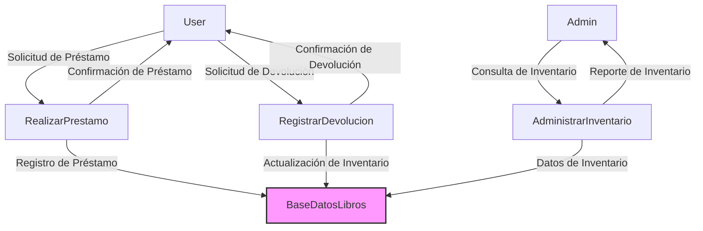

# Técnicas de Modelado: DFD y ERD

## Resumen

Las técnicas de modelado como Diagramas de Flujo de Datos (DFD) y Diagramas de Entidad-Relación (ERD) son herramientas fundamentales en la ingeniería de software y el análisis de sistemas. Este artículo examina los conceptos clave, las características y las aplicaciones de estas dos técnicas, proporcionando una visión detallada para entender su importancia y utilidad en el diseño y desarrollo de sistemas.

## Contenido

### Introducción

El modelado de sistemas es una etapa crítica en el desarrollo de cualquier proyecto de software. Ayuda a los desarrolladores y a los interesados a entender cómo funcionará el sistema antes de que se escriba una sola línea de código. DFD y ERD son dos técnicas de modelado que abordan diferentes aspectos del sistema: mientras que DFD se centra en los procesos y el flujo de datos, ERD se ocupa de las entidades y sus relaciones.

### Diagramas de Flujo de Datos (DFD): Una Exploración Más Detallada

#### Introducción

Los Diagramas de Flujo de Datos (DFD) son una de las técnicas de modelado más empleadas en ingeniería de sistemas y software. Fueron popularizados en los años 70 y se utilizan principalmente para representar la circulación de información dentro de un sistema, permitiendo visualizar cómo los datos se procesan y transforman a lo largo del flujo. Este método gráfico es especialmente útil para el análisis y el diseño de sistemas.

#### Niveles de DFD

Un DFD puede presentarse en diferentes niveles de abstracción:

1. **Nivel 0 (Diagrama de Contexto)**: Ofrece una visión de alto nivel del sistema, mostrando sus interacciones con entidades externas. No se muestran detalles internos.
2. **Nivel 1**: Este nivel muestra los principales procesos y flujos de datos del sistema. A menudo, es suficiente para una comprensión básica del sistema.
3. **Niveles 2, 3, …**: Estos diagramas más detallados descomponen los procesos en subprocesos y muestran flujos de datos más específicos.

#### Notación

La notación más tradicional para DFD incluye los siguientes elementos:

- **Procesos**: Representados por círculos o elipses, indican transformaciones o cálculos que suceden en el sistema.
- **Flujos de Datos**: Usando flechas, estos elementos señalan cómo los datos se mueven entre las diferentes partes del sistema.
- **Almacenes de Datos**: Representados por dos líneas paralelas, indican donde los datos se guardan temporal o permanentemente.
- **Entidades Externas**: Utilizando cuadrados o rectángulos, se muestran las entidades que interactúan con el sistema pero que son externas a este.

#### Ejemplo Práctico

Supongamos que estamos modelando un sistema de gestión de biblioteca:

- **Entidades Externas**: Podrían incluir a los lectores, proveedores de libros y sistemas de pagos.
- **Procesos**: Procesos como "Realizar Préstamo", "Registrar Devolución", "Administrar Inventario" podrían ser relevantes.
- **Flujos de Datos**: Podrían ser "Solicitud de Préstamo", "Registro de Devolución", "Actualización de Inventario", etc.
- **Almacenes de Datos**: "Base de Datos de Libros", "Base de Datos de Usuarios", etc.

#### Ventajas y Desventajas

**Ventajas**:

1. **Claridad**: Los DFD son gráficos y fáciles de entender, lo que facilita la comunicación entre los interesados.
2. **Modularidad**: Permiten un enfoque modular al diseño, facilitando la descomposición de sistemas complejos en componentes más manejables.
3. **Versatilidad**: Pueden ser utilizados en una variedad de industrias y tipos de proyectos.

**Desventajas**:

1. **Ambigüedad**: Dada su simplicidad, los DFD pueden ser ambiguos y podrían requerir documentación adicional para aclarar ciertos aspectos.
2. **Falta de Detalles de Implementación**: No muestran detalles sobre cómo se implementan los procesos, lo que puede requerir el uso de otras técnicas de modelado.

#### Conclusión

Los Diagramas de Flujo de Datos son una herramienta poderosa en el análisis y diseño de sistemas. Proporcionan un método gráfico para visualizar cómo los datos fluyen a través del sistema, lo que es invaluable para la toma de decisiones y la planificación estratégica.

#### Referencias

- DeMarco, T. (1978). "Structured Analysis and System Specification".
- Yourdon, E. y Constantine, L. L. (1979). "Structured Design: Fundamentals of a Discipline of Computer Program and Systems Design".

### Diagramas de Entidad-Relación (ERD): Un Estudio Detallado

#### Introducción

Los Diagramas de Entidad-Relación (ERD) son fundamentales en el modelado de datos y se utilizan extensamente en el diseño de bases de datos. Inicialmente propuestos por Peter Chen en 1976, estos diagramas facilitan la representación de la estructura lógica de una base de datos de una manera gráfica y fácil de entender. 

#### Elementos Básicos

Los ERD constan de los siguientes componentes básicos:

- **Entidades**: Estas son las "cosas" acerca de las cuales se desea almacenar información. Por ejemplo, en una base de datos de una biblioteca, las entidades podrían ser Libro, Usuario, Préstamo, etc.
  
- **Atributos**: Estos son los datos que se desean almacenar para cada entidad. Para la entidad "Libro", los atributos podrían incluir Título, Autor, ISBN, etc.

- **Relaciones**: Estas describen cómo las diferentes entidades están asociadas entre sí. Las relaciones pueden ser de uno a uno, de uno a muchos, o de muchos a muchos.

#### Notación

Existen varias notaciones utilizadas para los ERD, como la notación de Chen, la notación de Crow's Foot y la notación UML. Estas notaciones tienen ligeras diferencias en cómo representan entidades, atributos y relaciones, pero la idea subyacente sigue siendo la misma.

#### Construcción de un ERD

Los pasos básicos para construir un ERD son:

1. **Identificación de Entidades**: Listar todas las entidades que formarán parte del sistema.
2. **Identificación de Atributos**: Para cada entidad, listar los atributos correspondientes.
3. **Identificación de Relaciones**: Determinar cómo las entidades se relacionan entre sí.
4. **Normalización**: Este es un proceso opcional para minimizar la redundancia y la complejidad al organizar los datos.

#### Ejemplo Práctico

Tomando el caso de una biblioteca, un ERD simple podría tener las siguientes entidades y relaciones:

- Entidades: `Libro`, `Usuario`, `Préstamo`
- Atributos:
  - `Libro`: Título, Autor, ISBN
  - `Usuario`: ID, Nombre, Dirección
  - `Préstamo`: ID_Prestamo, Fecha
- Relaciones:
  - `Usuario` a `Préstamo`: Un usuario puede tener múltiples préstamos.
  - `Préstamo` a `Libro`: Un préstamo puede incluir múltiples libros.

#### Ventajas y Desventajas

**Ventajas**:

1. **Facilita la Comunicación**: Los ERD son excelentes herramientas de comunicación entre diversas partes interesadas.
2. **Simplifica el Diseño**: Ayuda a los diseñadores a visualizar la estructura de la base de datos, lo que simplifica la implementación.
3. **Documentación**: Sirve como una excelente forma de documentación para futuras referencias.

**Desventajas**:

1. **Complejidad**: En sistemas grandes, el ERD puede llegar a ser muy complejo, lo que dificulta su comprensión.
2. **Cambios Requeridos**: Si hay cambios en la estructura de la base de datos, el ERD también debe ser actualizado, lo cual puede ser un proceso tedioso.

#### Conclusión

Los Diagramas de Entidad-Relación son cruciales en el diseño de bases de datos. Proporcionan una representación gráfica que es invaluable para el análisis y la toma de decisiones en el diseño de bases de datos. Además, también son de gran utilidad en otros campos como la ingeniería de software y la organización de información en sistemas empresariales.

#### Referencias

- Chen, P.P. (1976). "The Entity-Relationship Model: Toward a Unified View of Data". ACM Transactions on Database Systems.
- Elmasri, R., & Navathe, S. B. (2011). "Fundamentals of Database Systems".

Estas técnicas permiten a los diseñadores y desarrolladores construir sistemas más robustos, coherentes y eficientes.

### Comparación entre DFD y ERD

- **Enfoque**: Mientras que DFD se centra en los procesos y el flujo de datos, ERD se enfoca en la estructura de datos y las relaciones entre entidades.
- **Uso**: DFD se utiliza principalmente en la fase de análisis y diseño del ciclo de vida del desarrollo de software, mientras que ERD se usa en el diseño y la implementación de bases de datos.

### Conclusión

DFD y ERD son técnicas de modelado esenciales en el campo de la ingeniería de software. Cada una ofrece un conjunto único de herramientas y perspectivas que facilitan el análisis y el diseño de sistemas complejos. Al entender cómo y cuándo utilizar estas técnicas, los desarrolladores y analistas pueden crear sistemas más eficientes, coherentes y mantenibles.

## Referencias

- Gane, C. y Sarson, T. (1979). "Structured Systems Analysis: Tools and Techniques". 
- Chen, P.P. (1976). "The Entity-Relationship Model: Toward a Unified View of Data". ACM Transactions on Database Systems.
  
